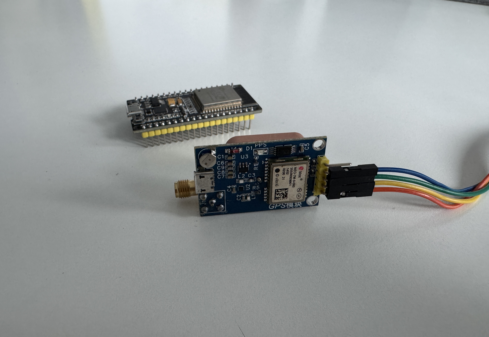

# ESP32 GPS Quickstart

This project is a PlatformIO quickstart for an ESP32 connected to a u-blox 7M GPS module and a small OLED display. It reads live GPS data, shows latitude and longitude on the display, and performs reverse geocoding over Wi-Fi to print a short address.

The goal is to keep the example approachable for beginners while still being useful as a starting point for real hardware testing with an ESP32 and a u-blox 7M receiver.



## Features

- Reads GPS data with `TinyGPSPlus`
- Uses ESP32 `UART2` for the u-blox 7M GPS module
- Shows coordinates, satellite count, HDOP, and a short address on a 128x64 OLED
- Sends reverse-geocoding requests to OpenStreetMap Nominatim over Wi-Fi
- Builds with PlatformIO

## Hardware Requirements

- 1 x ESP32 development board
- 1 x u-blox 7M GPS module with UART interface
- 1 x 128x64 OLED display compatible with `U8g2`
- Jumper wires
- USB cable for programming and serial output

## Hardware Used In This Project

- ESP32 board model: `ESP32`
- GPS module model: `u-blox 7M (NEO-7M family) UART GPS module`
- OLED model: `SH1106 128x64 I2C`

## Wiring

The firmware uses the following ESP32 pins:

| Function | ESP32 Pin | External Module Pin | Notes |
| --- | --- | --- | --- |
| GPS RX on ESP32 | GPIO16 | GPS TX | UART2 receive |
| GPS TX on ESP32 | GPIO17 | GPS RX | UART2 transmit |
| I2C SDA | `BOARD-DEPENDENT` | OLED SDA | Common example: GPIO21, but ESP32 I2C pins are flexible |
| I2C SCL | `BOARD-DEPENDENT` | OLED SCL | Common example: GPIO22, but ESP32 I2C pins are flexible |
| Power | `BOARD-DEPENDENT` | GPS VCC / OLED VCC | Follow the module datasheet and your board voltage compatibility |
| GND | GND | GPS GND / OLED GND | Common ground required |

The sketch does not explicitly assign custom I2C pins. On many ESP32 boards, common defaults are `GPIO21` for SDA and `GPIO22` for SCL, but ESP32 pin mapping is flexible, so check your specific board pinout and adapt the code if needed.

For a cleaner public repository, the hardware notes are also available in [docs/HARDWARE.md](docs/HARDWARE.md).

## Project Structure

- `src/main.cpp`: main firmware example
- `include/config.example.h`: example Wi-Fi configuration
- `include/config.h`: local private Wi-Fi configuration file, ignored by Git
- `platformio.ini`: PlatformIO environment and dependency settings
- `docs/HARDWARE.md`: wiring, power, and hardware integration notes
- `assets/gps.jpg`: photo of the GPS module used in this project

## Wi-Fi Configuration

This repository is prepared so Wi-Fi credentials are not stored in tracked source files.

1. Copy `include/config.example.h` to `include/config.h`.
2. Edit `include/config.h`.
3. Replace the placeholder SSIDs and passwords with your local network credentials.

Important:

- `include/config.h` is intentionally ignored by Git.
- Do not commit real Wi-Fi credentials, tokens, or other secrets.
- If you previously committed real credentials, rotate them before making the repository public.

## Software Dependencies

This project builds with PlatformIO and uses these Arduino libraries:

- `TinyGPSPlus`
- `U8g2`
- `ArduinoJson`

The dependencies are declared in [platformio.ini](platformio.ini).

## Build And Upload

Install [PlatformIO](https://platformio.org/) and open the project folder.

Build the firmware:

```bash
pio run
```

Upload to the board:

```bash
pio run --target upload
```

## Serial Monitor

Open the serial monitor with:

```bash
pio device monitor
```

The project uses `115200` baud.

When the GPS has a fix, you should see output similar to:

```text
45.12345, 9.12345 | Example Street Example City | Sat:10 HDOP:0.9
```

## Verifying GPS Output

- Power the ESP32 and GPS module.
- Wait for the Wi-Fi connection to complete.
- Wait for the GPS module to obtain a fix.
- Check the OLED for latitude, longitude, satellite count, and address text.
- Check the serial monitor for the same information in text form.

If no coordinates appear, move the device near a window or outdoors and allow more time for the first GPS fix.

## Notes And Limitations

- The project uses OpenStreetMap Nominatim for reverse geocoding, so an active Wi-Fi connection is required to show addresses.
- Reverse-geocoding requests are rate-limited in the sketch to one request every 15 seconds.
- The code contains a contact email in the Nominatim user agent string. Review and replace it if you do not want to publish that contact detail.
- The firmware assumes a u-blox 7M GPS module, or another compatible receiver that speaks standard NMEA sentences at `9600` baud over UART.
- Final I2C wiring and power connections depend on the specific ESP32 development board and module variant you use.

## License

This repository is released under the [MIT License](LICENSE).
